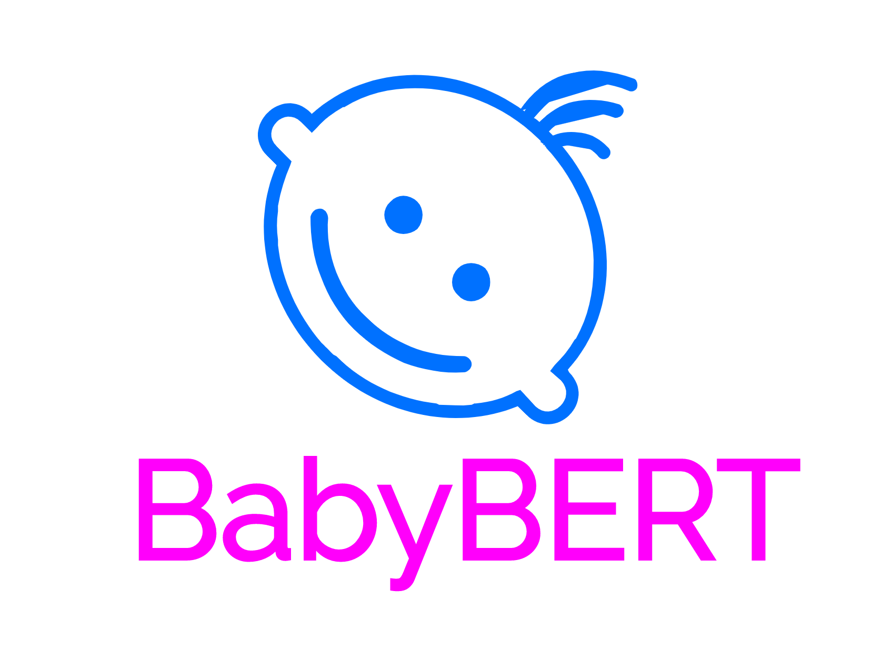

<div align="center">
  
</div>

## Background

This repository contains research code that compares syntactic abilities of BERT trained on 
a small cognitively plausible corpus of child-directed speech (5M words from American-English CHILDES) 
to that trained on a large (standard) adult-generated text.

The code is for research purpose only. 
The goal of this research project is to understand language acquisition from the point of view of distributional learning models.

## History

- 2020 (Spring): The BabyBERT project grew out of the BabySRL project led by Cynthia Fisher, Dan Roth, Michael Connor and Yael Gertner, 
whose published work is available [here](https://www.aclweb.org/anthology/W08-2111/). 
Having found little benefit for joint SRL and MLM training of a custom (smaller in size) version of BERT,
 a new line of research into BERT's success on syntactic tasks was begun. 
This led to the development of a model that is more similar to RoBERTa than BERT.
 
## Probing for syntactic knowledge

Probing data can be found [here](https://github.com/phueb/Zorro). 


## BabyBERT vs. BERT
 
BabyBERT is inspired by the original BERT model, but departs from it in many ways.
 
Because our goal is to work with a compact model, optimized for acquiring distributional knowledge about child-directed speech,
 rather than some down-stream application, BabyBERT differs from the original BERT in the following ways:
 
- trained on American-English child-directed speech: ~5M words vs ~2B words 
- fewer hidden units and layers: ~10M parameters vs ~100M
- smaller vocabulary: ~8K vs ~30K
- Byte-Pair BPE tokenization (as in RoBERTa)
- no next-sentence prediction objective (as in RoBERTa)
- the same masking pattern is never applied to the same sequence (more similar but not identical to RoBERTa)
- only 2 tokens per sequence are masked, instead of masking each token with probability of 0.15
- masked locations are never replaced by the original or a random word
- smaller batch size: 16 vs. 256
- each epoch guarantees that all examples in the training data has been seen
- only 1 complete pass through training data: 1 epoch vs. ~40 epochs
- training examples are ordered by the age of the child to whom the utterance is directed to
- sequences consist of 1 utterance/sentence, as opposed to a pair of segments containing multiple sentences
- L2 weight decay of 0.00 instead of 0.01

The last point is extremely important for achieving good performance on our number agreement tasks specifically made for CHILDES.
To achieve above-chance performance on number agreement, the model must not be trained with more than 1 utterance per input.

## BabyBERT vs. fairseq RoBERTa
To train a BabyBERT like model using `fairseq`, make sure to use the following command line arguments: 

```bash
--fp32
--batch-size 16
--clip-norm 1.0 (assuming this is the gradient norm, which I clip to 1.0 instead of 0.0)
--lr-scheduler linear_decay
--adam-betas '(0.9, 0.999)'
--weight-decay 0.0
--update-freq 1
--total-num-update 160000
```

## Pre-processing Pipeline

1. Raw text data, in `txt` files, was previously tokenized using `spacy` which splits on contractions.
2. Sentences are separated and those that are too short or too long are excluded.
3. Multiple sentences may be combined (but default is 1) into a single sequence.
4. Each sequence is sub-word tokenized with custom-trained BBPE Tokenizer from `tokenizers`.
5. One BBPE (sub-)token per sequence is masked.
6. Multiple sequences are batched together (default is 16).
7. Each batch of sequences is input to BBPE Tokenizer `batch_encode_plus()` method, 
which produces output compatible with the `forward()` method of BabyBERT (a `transfomers.BertModel`)


## Using the BabyBERT vocab

To use our 8192-words vocabulary for training a Roberta model in `fairseq` v0.10.2, 

```python
from fairseq.data.encoders.gpt2_bpe import GPT2BPE, GPT2BPEConfig

encoder_json_path = 'data/corpora/c-n-w-8192/vocab.json'
vocab_bpe_path = 'data/corpora/c-n-w-8192/merges.txt'
cfg = GPT2BPEConfig(gpt2_encoder_json=encoder_json_path,
                    gpt2_vocab_bpe=vocab_bpe_path)
encoder = GPT2BPE(cfg)
```

The resultant object `encoder` can then be passed to `roberta.bpe` to replace the default encoder, 
 which uses 50k words.
 
To get a feeling for how this encoder splits text, use: 

```python
bpe_tokens = []
for token in encoder.bpe.re.findall(encoder.bpe.pat, text):
    token = "".join(encoder.bpe.byte_encoder[b] for b in token.encode("utf-8"))
    bpe_tokens.extend(
        bpe_token for bpe_token in encoder.bpe.bpe(token).split(" ")
    )
print(bpe_tokens)
```

## Running multiple simulations at the same time

Code in this repository is executed using [Ludwig](https://github.com/phueb/Ludwig),
 a library for running GPU-bound Python jobs on dedicated machines owned by the UIUC Learning & Language Lab.

To install all the dependencies, including `Ludwig`:

```python3
pip3 install -r requirements.txt
```
 
You will also need to obtain test sentences,
 and point `configs.Dirs.probing_sentences` to the folder where you saved them on your machine.

### Pre-training from scratch

To run 10 replications of each configuration on your machine,
 edit the path to `Zorro` probing sentences in `configs.Dirs.probing_sentences`. 
Then, type the following into the terminal:

`ludwig -r10 -i`

## Compatibility

Tested on Ubuntu 18.04, Python 3.7, transformers=3.02, and torch==1.2.0
